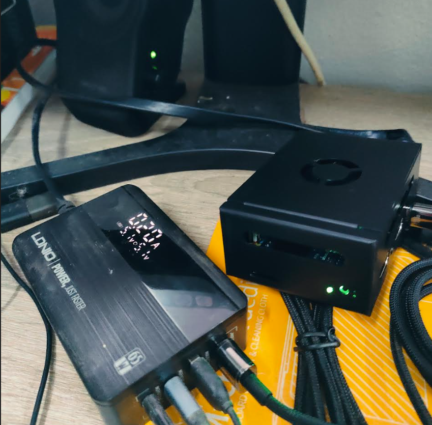

## Orange-pi-5-max-kubeadm-dual-stack
## Hardware
```
Orange pi 5 max
Cpu: 8-core 64-bit processor
Memory: ddr5 16gb
NVMe SSD: SAMSUNG 980 PCIe/NVMe M.2 2280
OS: Ubuntu 22.04 LTS (with Rockchip Linux 6.1)
```


## Install OS/nvme ssd boot
```

```
## Config /etc/hosts
```
```
## config sysctl
```
echo net.ipv6.conf.all.forwarding=1 >> /etc/sysctl.conf
echo net.ipv4.conf.all.forwarding=1 >> /etc/sysctl.conf
echo net.ipv4.ip_forward=1 >> /etc/sysctl.conf
sysctl -p --system
modprobe br_netfilter
```
## install crio kubeadm kubectl kubelet
```
KUBERNETES_VERSION=v1.31
CRIO_VERSION=v1.30
apt-get update
apt-get install -y software-properties-common curl
curl -fsSL https://pkgs.k8s.io/core:/stable:/$KUBERNETES_VERSION/deb/Release.key |
    gpg --dearmor -o /etc/apt/keyrings/kubernetes-apt-keyring.gpg

echo "deb [signed-by=/etc/apt/keyrings/kubernetes-apt-keyring.gpg] https://pkgs.k8s.io/core:/stable:/$KUBERNETES_VERSION/deb/ /" |
    tee /etc/apt/sources.list.d/kubernetes.list

curl -fsSL https://pkgs.k8s.io/addons:/cri-o:/stable:/$CRIO_VERSION/deb/Release.key |
    gpg --dearmor -o /etc/apt/keyrings/cri-o-apt-keyring.gpg

echo "deb [signed-by=/etc/apt/keyrings/cri-o-apt-keyring.gpg] https://pkgs.k8s.io/addons:/cri-o:/stable:/$CRIO_VERSION/deb/ /" |
    tee /etc/apt/sources.list.d/cri-o.list

apt-get update
apt-get install -y cri-o kubelet kubeadm kubectl
systemctl enable crio --now
```